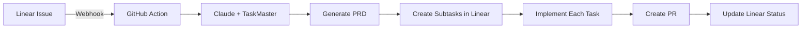

# Claude Code Template (CCT) - Linear + TaskMaster Integration

A powerful automation framework that enables fully cloud-hosted development workflows. Create projects with one command and manage everything through Linear - no local machine needed after setup!

## 🎯 Overview

**One Command Setup**: `cct my-project` creates everything you need.

This template creates an automated workflow where:
1. You run `cct my-project` to create and configure a new repository
2. Create issues in Linear with @claude mentions
3. Claude automatically generates PRDs and breaks them into subtasks
4. Tasks execute sequentially with real-time Linear updates
5. PRs are created and linked back to Linear issues

## ⚡ Quick Start

```bash
# Install CCT globally (one-time)
curl -sSL https://github.com/yourusername/claude-code-template/raw/main/install.sh | bash

# Create any new project
cct my-awesome-project

# That's it! Follow the Linear webhook instructions and you're done.
```

## 🚀 Features

- **One Command Setup**: `cct my-project` does everything
- **Fully Cloud Hosted**: Work from Linear on any device - phone, tablet, or computer
- **Automated PRD Generation**: Converts Linear issues into detailed Product Requirements Documents  
- **Smart Task Breakdown**: Uses TaskMaster to create dependencies and subtasks
- **Real-time Sync**: Keeps Linear and TaskMaster in perfect sync
- **GitHub Actions Integration**: Automatically triggers on @claude mentions
- **Template-based Setup**: Easily replicate across all your projects
- **Team Collaboration**: Anyone can create issues in Linear to trigger development

## 📁 Repository Structure

```
claude-code-template/
├── .github/
│   ├── workflows/
│   │   └── claude-code.yml          # GitHub Actions workflow
│   └── ISSUE_TEMPLATE/
│       └── feature_request.md        # Issue template
├── .claude/
│   ├── agents/
│   │   ├── linear-prd-generator.md  # PRD generation agent
│   │   ├── task-executor.md         # Task execution agent
│   │   └── linear-sync.md           # Linear synchronization agent
│   ├── workflows/
│   │   └── linear-taskmaster-flow.md # Main integration workflow
│   ├── mcp.json                     # MCP server configuration
│   └── CLAUDE.md                    # Claude Code rules
├── .taskmaster/
│   └── docs/
│       └── .gitkeep
├── setup.sh                         # Auto-setup script
└── README.md                        # This file
```

## 🛠️ Installation

### Quick Install (Recommended)

```bash
# One-time global install
curl -sSL https://github.com/yourusername/claude-code-template/raw/main/install.sh | bash

# Then create projects with one command
cct my-new-project
```

### Manual Installation

#### Step 1: Linear Setup

**For Local Development (Claude Code):**
```bash
# Add Linear as a global MCP server (uses OAuth, no API key needed)
claude mcp add linear --scope user --transport sse https://mcp.linear.app/sse
```

**For GitHub Actions (Required):**
Get a Linear API key from Settings → API → Personal API keys, then add to GitHub secrets:
```bash
gh secret set LINEAR_API_KEY -b "lin_api_YOUR_KEY_HERE"
```

#### Step 2: Create Your Template Repository

1. Create a new repository on GitHub called `claude-code-template`
2. Copy all files from this directory to your repository
3. Mark it as a template repository in GitHub settings

#### Step 3: Configure MCP Servers

Add the following to your Claude Code MCP configuration:

**For Claude Code** (`.claude/mcp.json`):
```json
{
  "mcpServers": {
    "taskmaster-ai": {
      "command": "npx",
      "args": ["-y", "task-master-ai"],
      "env": {
        "PERPLEXITY_API_KEY": "${PERPLEXITY_API_KEY}"
      }
    },
    "linear": {
      "command": "npx",
      "args": ["-y", "mcp-remote", "https://mcp.linear.app/sse"]
    }
  }
}
```

**Note**: No Anthropic API key needed - TaskMaster automatically uses Claude Code's backend!

### Step 4: Save Your Secrets Once (One-Time Setup)

```bash
# Save your API keys locally for reuse across all projects
./setup-secrets-once.sh
```

This saves your secrets to `~/.claude-code-template/secrets.env` for automatic reuse.

### Step 5: Use Template for New Projects

```bash
# Quick method (after installing CCT)
cct my-new-project

# Or manual method
gh repo create my-new-project --template=yourusername/claude-code-template
cd my-new-project
./setup-cloud-workflow.sh
```

**⚠️ CRITICAL**: The Claude Code GitHub App must be installed per repo. The setup script handles this automatically and reuses your saved secrets!

## 🔄 Workflow Process

### Two Workflow Options:

#### Option 1: Fully Cloud Workflow (No Local Machine Needed!) 🌟
1. **One-time setup**: Run `cct my-project` to create repo with automation
2. **Configure Linear webhook**: Run `./setup-linear-webhook.sh`
3. **Everything else in Linear**:
   - Create issue in Linear with detailed description
   - Add @claude mention in description or comment
   - Claude automatically triggers via webhook
   - Generates PRD with TaskMaster
   - Creates subtasks in Linear
   - Implements each subtask sequentially
   - Creates atomic commits
   - Opens PR when complete
   - Updates Linear status in real-time

#### Option 2: GitHub-Triggered Workflow
1. Create issue in GitHub with @claude mention
2. Or trigger from Linear issue reference
3. Claude processes and implements

### Automated Processing Flow


### Benefits of Cloud Workflow
- **Work from anywhere** - Just need Linear access
- **Team collaboration** - Anyone can create issues
- **Mobile friendly** - Create issues from Linear mobile app
- **No local setup** - Everything runs in the cloud
- **Real-time updates** - See progress in Linear
- **Automatic implementation** - Just describe what you want

## 🤖 Subagents

### Linear PRD Generator
Converts Linear issues into comprehensive PRDs:
- Extracts issue context
- Generates detailed requirements
- Creates implementation plan
- Updates Linear with PRD

### Task Executor
Handles sequential task implementation:
- Respects dependencies
- Updates Linear status
- Creates atomic commits
- Maintains progress tracking

### Linear Sync
Keeps everything synchronized:
- Bidirectional updates
- Status synchronization
- Dependency management
- Real-time progress

## 🔧 Configuration

### Claude Code Rules (CLAUDE.md)
The main configuration file that defines:
- Available subagents
- MCP server settings
- Workflow triggers
- Execution rules
- Rule profiles (cursor, claude, cline, roo, etc.)

### GitHub Actions
Automatically configured to:
- Trigger on @claude mentions
- Use Claude Code Action v1
- Pass environment variables
- Execute workflows

### TaskMaster Settings (v0.18+ with Claude Code Support!)
Configure models in chat:
```
# With Claude Code (no API key needed)
Change the main model to sonnet --claude-code
Change the research model to perplexity/llama-3.1-sonar-large-128k-online

# Or via CLI
task-master models --set-main sonnet --claude-code
task-master models --set-research perplexity/llama-3.1-sonar-large-128k-online
```

Supported AI Providers:
- **Claude Code** (no API key needed): `claude-code/opus`, `claude-code/sonnet`
- **Anthropic**: Claude 3.5 Sonnet, Claude 3 Opus
- **OpenAI**: GPT-4o, GPT-4 Turbo
- **Perplexity** (great for research): Sonar models with real-time web access
- **Google**: Gemini Pro models
- **xAI**: Grok models
- **OpenRouter**: Access to 100+ models

## 📝 Usage Examples

### Creating a Feature
1. Create Linear issue: "Add user authentication with JWT"
2. Add description with @claude mention
3. Watch as:
   - PRD is generated
   - Tasks are created
   - Implementation begins
   - PR is opened

### Monitoring Progress
- Check Linear for real-time task updates
- View TaskMaster for detailed progress
- Review commits linked to tasks
- Track PR status

## 🔄 Maintaining Central Configuration

To update all projects when you change the template:

```bash
# In your project
git remote add template https://github.com/yourusername/claude-code-template
git fetch template
git merge template/main --allow-unrelated-histories
```

## 🚦 Environment Variables

Required secrets in GitHub Actions:
- `LINEAR_API_KEY` - **REQUIRED** (Linear MCP OAuth doesn't work headless)
- `ANTHROPIC_API_KEY` - **REQUIRED** for Claude Code Action to work
- `PERPLEXITY_API_KEY` - **OPTIONAL** for research capabilities

**Important Reality Check**:
- **Local Development**: Can use Claude Code (no API key) via TaskMaster v0.18+
- **GitHub Actions**: REQUIRES Anthropic API key (Claude Code CLI auth doesn't work in CI/CD)
- **Linear**: OAuth locally, API key in GitHub Actions

## 🎯 Best Practices

1. **PRD Quality**: The more detailed your Linear issue, the better the generated tasks
2. **Task Granularity**: Keep tasks small and focused
3. **Dependencies**: Define clear dependencies in your PRD
4. **Commit Messages**: Let the system handle atomic commits
5. **Review**: Always review generated PRs before merging

## 🔍 Troubleshooting

### TaskMaster Not Using Claude Code Backend
- Verify Claude Code CLI is installed
- Run `taskmaster models` to check available models
- Select `claude-code/sonnet` or `claude-code/opus`

### Linear Not Syncing
- Check Linear GitHub integration
- Verify webhook configuration
- Ensure @claude is mentioned correctly

### GitHub Action Not Triggering
- Check workflow file is in `.github/workflows/`
- Verify @claude mention format
- Check GitHub Actions is enabled

## 📚 Resources

- [TaskMaster Documentation](https://docs.task-master.dev/)
- [Linear API Documentation](https://developers.linear.app/)
- [Claude Code Documentation](https://docs.anthropic.com/claude-code)
- [MCP Protocol Specification](https://modelcontextprotocol.io/)

## 🤝 Contributing

Feel free to submit issues and enhancement requests!

## 📄 License

MIT License - feel free to use this template for your projects

---

Created with ❤️ for automated development workflows